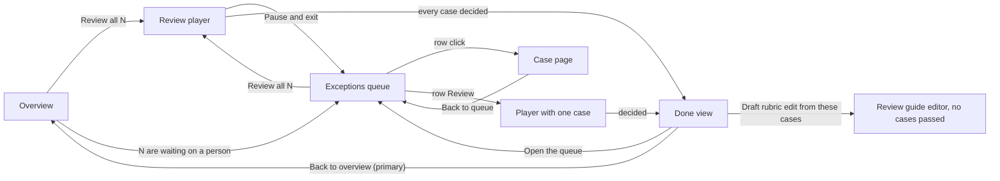
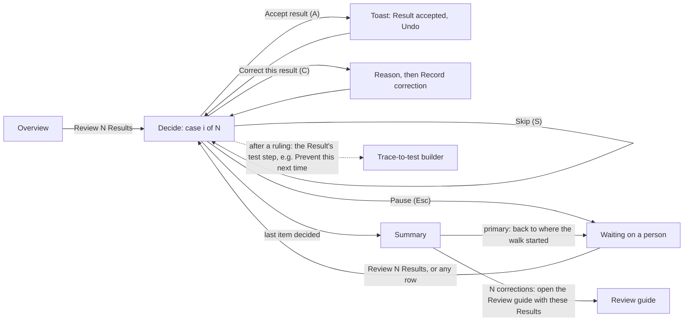

# UX audit 2: the triage flow (Exceptions queue, case page, review player)

Status: **audit record, not product authority.** It records CURRENT
observations and proposals for founder review. Items marked *decide* need a
decision before implementation. No item proposes an ADR.

Last reviewed: 2026-09-26 · code at `2c82321`

This round covers the attention flow that the Overview hands off to:

- the queue at `/exceptions`;
- the case page at `/cases/:id`;
- the sequential review player at `/review`, with its done view.

The shell findings from [round 1](2026-09-26-shell-and-overview.md) (S1–S9)
apply here too and are not repeated. T9 adds the cases this flow contributes.

## How to read this

Evidence labels, severity scale, and statuses follow
[round 1](2026-09-26-shell-and-overview.md#how-to-read-this). Rules cite the
`ux-craft` references on overclock branch
`claude/app-layout-dashboard-audit-ywvz9j` at `6b3b476`. That branch is
[overclock#37](https://github.com/luka-zivkovic/overclock/pull/37) plus the
shadcn and review changes made after round 1. This round leans on two of
those additions:

- `user-flow` › `patterns.md` › Triage a queue;
- `page-structure` › `review.md` (the render-and-measure checks).

## Components in the proposals

CURRENT: shadcn is set up (`apps/web/components.json`, new-york style) but
thinly used.

- `components/ui/` holds seven components: Button, Card, Table, Badge,
  Input, Textarea, and Separator. They use the paper/ink tokens, and some
  are extended: Button adds `primary` and `signal` variants, and Table wraps
  a scroll region.
- `apps/web/package.json` lists seven Radix packages, but only `react-slot`
  (Button) and `react-separator` are imported. `dropdown-menu`, `label`,
  `select`, `tabs`, and `tooltip` are installed and unused.
- Product components live in `components/rubrist/` (SectionHead,
  EmptyShell, Receipt, MarginNote, Chip, Ref, and others). Nine dialogs are
  hand-built (`role="dialog"`, one each in nine files), and there is no
  toast. Selects are native, and tabs are hand-built
  (`screens/skill.tsx:32`).

Decision (founder, 2026-09-26): take the middle path.

- Behavior that is hard to get right comes from shadcn's Radix-based
  components, restyled to the paper/ink tokens. That covers dialogs,
  sheets, menus, tooltips, tabs, toggle groups, and toasts.
- Product-specific presentation stays in `components/rubrist/`.

Each proposal marks its component:

- *installed*: already in `components/ui/`;
- *add*: run `npx shadcn add <name>` in `apps/web`, then restyle it;
- *Rubrist*: an existing `components/rubrist/` component.

This round's proposals add five components: `Sheet` (T5, T6), `ToggleGroup`
(T7), `Sonner` (T4), `AlertDialog` (the Pause guard), and `Skeleton`
(loading rows).

## Method

- The code read covered `screens/exceptions.tsx`, `screens/trace.tsx`,
  `components/trace-detail.tsx`, `screens/review.tsx`,
  `components/review-player.tsx`, and `lib/exception-queue.ts`.
- **Rendering.** Demo stack at 1440×900 and 390×844 in Guided display.
  - The queue holds five real demo case ids (`case_exc_001`–`003`,
    `case_205`, `case_101`) under synthetic titles, results, and categories,
    set by rewriting the demo `/api/dashboard` response. This keeps row
    clicks and the player working end to end.
  - The unruled case state comes from rewriting `/api/cases/:id`: the human
    label is removed and the history is cut to the evaluator run. Every demo
    case is already ruled.
- **Measurements** follow `review.md` §3: overflow at 390 px, clipped
  controls, filled buttons per state, the primary's position, `h1` count,
  document title, and location.
- **Vocabulary.** I ran the upgraded `scan_labels.py` with a throwaway
  `UX.md` built from the product-language contract's vocabulary. Nothing was
  committed to this repository.

## Top findings, in fix order

| # | Finding | Sev | Status |
|---|---|---|---|
| 1 | The decision is buried. "Record your ruling" is the last card of the right column: its Accept button sits at y≈978 in a 900 px window, and ≈1,540–1,590 px down on a phone. Above it in that column are the evaluator panel, the Judge call panel, and the decision history. On a phone the raw JSON conversation comes first as well. (T1) | 3 | fix |
| 2 | The page's only filled button is not the decision. The case page leads with a test banner above the case title, and the banner's button is the filled one. The ruling buttons are outlined, and in the player nothing is filled until a form opens. (T2) | 3 | fix |
| 3 | There are two surfaces for one decision, and each item costs a round trip. A row click opens a case page with no Next. A row "Review" opens a one-case player whose done view sends you to the Overview. (T3) | 3 | fix |
| 4 | Along the flow, the queue has seven names. Ruling buttons submit under a different name than they open with, and the contract's "Correct this result" is not used. (T8) | 3 | decide |
| 5 | One keystroke records a ruling and moves on, with no undo. (T4) | 2 | fix, *decide* undo semantics |
| 6 | On phones the queue shows two columns. The Result and every row action sit behind a sideways scroll that nothing on a touch screen signals. (T5) | 2 | fix |
| 7 | Several links break the scent: "Open rubric alongside" leaves the queue; "Draft rubric edit from these cases" passes no cases; "Compare and resolve" opens a page Guided display hides; the default Back goes to Traces. (T6) | 2 | fix |
| 8 | In the queue's structure, active filter chips look like primaries, a pointer card sits above the list, and each row offers four interactions. (T7) | 2 | fix |
| 9 | Buttons change pages without being links, so none of them opens in a new tab. There are 58 across the app, a dozen of them on this flow. (T10) | 2 | fix |

---

## The flow as built (CURRENT)



What holds up (*keep*):

- **The queue's primary is in the header.** "Review all N"
  (`screens/exceptions.tsx:344-357`) is where the list archetype puts it
  (`archetypes.md` › List).
- **The walk respects the filter.** "Review all N" hands the player the
  exact filtered list in router state (`screens/exceptions.tsx:352`), and the
  player names the filtered scope ("Exceptions · policy_grounding", a raw
  value; see T7). The URL carries only the category (`?cluster=`, `:351`). A
  shared link or a new tab therefore re-filters by category alone
  (`lib/exception-queue.ts:22-25`) and drops the Result filter.
- **The player has the triage basics:** progress ("0 of 5 done · case 1"),
  Prev and Next, an item strip, and keyboard shortcuts with a visible legend.
  Pause and exit returns to the queue with a session receipt
  (`screens/exceptions.tsx:311-318`). These match `patterns.md` › Triage a
  queue.
- **The honesty copy is present and TARGET-aligned** (`PRODUCT.md` principles
  1 and 8). The queue says that reviewers can see evaluator evidence here,
  "so these rulings remain ungoverned legacy evidence". Promotion says it
  "does not create governed human truth".
- **A different ruling and a promotion each require a reason**, and both are
  stored append-only. For the ruling, see `components/trace-detail.tsx:744-755`.
  For promotion, see the reason field at `components/trace-detail.tsx:779-784`
  and the server-side append noted at `components/trace-detail.tsx:353-354`.
- **Case switching is race-guarded**, so a stale fetch cannot show one
  case's verdict on another (`screens/trace.tsx:30-81`).

---

## Findings

### T1. The decision is buried

Sev 3 · CURRENT · *fix*

The right column of the case page and the player renders in this order
(`components/trace-detail.tsx:612-835`):

1. a human ruling, if one exists;
2. "Latest evaluator opinion" (`:621-657`);
3. "Judge call" (`:659-664`);
4. "Decision history" (`:666-669`);
5. "Record your ruling" (`:671-834`).

The left column is the conversation as raw JSON in `pre` blocks.

Measured "Accept evaluator opinion" positions:

| Width | Case page | Player |
|---|---|---|
| 1440×900 | y≈978 | y≈980 |
| 390×844 | y≈1,593 | y≈1,537 |

In the demo, the Judge call panel above it holds only "No call meta
available." Demo cases carry no request metadata
(`apps/api/src/repository/demo-golden.ts:292-309`). Real runs record the
provider, model, and latency (`apps/api/src/workers/judge.ts:140-165`). The
panel then shows them, and a compiled-prompt disclosure, in both displays
(`components/rubrist/judge-call-panel.tsx:58-84`). Only the raw request and
response are Technical-only (`components/rubrist/judge-call-panel.tsx:86-116`).

- Rule: `patterns.md` › Triage a queue ("everything the decision needs on
  screen… one decision per item, with the usual choice as the primary");
  `archetypes.md` › Detail (the primary action is the object's most common
  next step); `placement.md` › Universal rules (reach on touch).
- Proposal: put the decision card first in the right column and make it
  sticky on desktop (`lg:sticky`). Show the Check's Result and reasoning
  inside it. Collapse Judge call and Decision history below it, open by
  default only in Technical display. On phones, use a sticky bottom action bar
  with the two decisions (see the blueprint).

### T2. The page's only filled button is not the decision

Sev 3 · CURRENT · *fix*

- The case page renders the trace-to-test banner (`screens/trace.tsx:150`,
  `screens/trace.tsx:255-297`) above the case title. Its button
  (`screens/trace.tsx:268-274`) is the page's only filled button, measured at
  y≈149. The first serif heading on the page is the banner's, not the case's.
- The banner's label follows the Result (`screens/trace.tsx:163-176,185-187`).
  A failed Result, as measured, shows "Prevent this next time". A passing one
  shows "Protect this behavior", and an ambiguous one "Make this a test". The
  banner has no filled button once the case has an enabled test
  (`screens/trace.tsx:230-241`) or after "Not now" (`screens/trace.tsx:244-253`).
- The three ruling buttons use `variant="default"`, which this app styles
  as an outline, until one is clicked
  (`components/trace-detail.tsx:686-714`).
- In the player, the decision view has no filled button until a form is
  opened. After that, the next bullet applies there too. The done view fills
  "Back to overview" (`screens/review.tsx:177`). When overrides were recorded,
  it also fills "Draft rubric edit from these cases" (`variant="signal"`,
  `screens/review.tsx:168`).
- Opening a form fills both its opener and its submit button:
  - Choosing promotion makes "Add to golden set" filled
    (`components/trace-detail.tsx:702`), next to a filled "Add regression
    reference" (`components/trace-detail.tsx:797`).
  - Choosing a different ruling makes "Record different ruling" the filled
    `signal` variant (`components/trace-detail.tsx:695`), next to a filled
    "Record review" (`components/trace-detail.tsx:758`).
  - On the case page, the banner's button makes a third.

TARGET: the contract lists "Protect this behavior" and "Prevent this next
time" among the optional next steps after the first-run completion summary.
They sit alongside "review or correct the result", and the contract calls
them progressive milestones, not first-run requirements
(`docs/beginner-onboarding-journey.md` › Optional next steps). The contract
does not say where they sit on the case page. Placing them after a ruling is
this audit's proposal (ASSUMPTION).

Rule: `placement.md` › In shadcn apps (one filled button per page state);
`archetypes.md` › Pages that change with state.

Proposal:

- Before a ruling, the filled button is "Accept result".
- After a ruling, the decision card's next step is the banner's action for
  that Result (for a failed one, "Prevent this next time"), and it becomes
  filled. The banner moves into that post-ruling state, and "Not now" stays.

### T3. Two surfaces for one decision, and a round trip per item

Sev 3 · CURRENT · *fix*

- A row click opens `/cases/:id` (`screens/exceptions.tsx:497-501`). That
  page has no Previous or Next (`screens/trace.tsx`), so every item costs a
  trip back to the queue.
- A row "Review" (`screens/exceptions.tsx:503-507`) opens
  `/review?caseId=…`, with `&cluster=…` when the row has a category. The
  player then contains only that case (`lib/exception-queue.ts:21`). After
  the decision, its done view shows "1 exception handled", and the primary
  "Back to overview" (`screens/review.tsx:98,177-179`) leaves the queue the
  user came from.
- Only "Review all N" walks the queue.

Rule:

- `patterns.md` › Triage a queue. Its trap is "a detail page with no way to
  reach the next item". Its landing is "a summary: how many were decided,
  skipped, and still waiting, plus the next action".
- `decisions.md` › Landing after completion ("Changed something: where they
  were").

Proposal:

- A row click and "Review" both open the player at that row, within the
  current filtered list, keeping Prev and Next. The URL already carries
  `caseId` and `cluster` (`lib/exception-queue.ts:9-13`). The change is in
  case selection: start the walk at `caseId` instead of returning that case
  alone (`lib/exception-queue.ts:21`).
- `/cases/:id` stays the deep-link view. When it is opened from the queue, it
  gains "Next waiting".
- The done view's primary returns to where the walk started.

### T4. One key, no undo

Sev 2 · CURRENT · *fix* · undo semantics *decide*

- A click on "Accept evaluator opinion", or, in the player, the A key
  (`components/trace-detail.tsx:529`), records a human ruling immediately
  (`components/trace-detail.tsx:429-451`).
- In the player, every decision advances to the next case
  (`components/review-player.tsx:173-178`). The next case's loading state
  replaces the confirmation text. After that, the only visible traces of the
  decision are the count ("1 of 5 done"), the progress bar, and the case's
  dot in the item strip (`components/review-player.tsx:216-218,258`). None
  of them says what was decided.
- The app has no toast system.

Rule: `decisions.md` › Confirmation, undo, or nothing (reversible actions act
immediately and offer Undo); `patterns.md` › Triage a queue (Undo for the
last decision); `decisions.md` › In shadcn apps (sonner with an Undo action).

Proposal: add shadcn's `Sonner` (*add*; it wraps the `sonner` package) and
mount its `Toaster` once in the root layout. Then call
`toast("Result accepted", { action: { label: "Undo", onClick } })`. Undo
appends a superseding record and moves the cursor back. ASSUMPTION: an
undo that appends rather than deletes fits the append-only record
(`PRODUCT.md` principle 8). Confirm that with the evidence model (*decide*).

### T5. On phones the Result and the actions sit behind a sideways scroll

Sev 2 · CURRENT · *fix*

The list is a `table-fixed` with column widths 240, 150, 110, auto, and 160
(`screens/exceptions.tsx:481-489`), 660 px in all. Every `Table` sits in a
horizontally scrolling region (`components/ui/table.tsx:6`). At 390×844 that
region is 348 px wide:

- Case and most of Judge category show;
- the Result chip, the note, "Full note", and "Review" sit beyond the right
  edge (14 row controls measured outside the visible region);
- nothing on a touch screen signals that the table scrolls sideways.

A tap on a row still opens the case, and "Review all N" still walks the
queue. The cost is discoverability: the Result, the column a reviewer scans
the queue for, is off-screen. No task is blocked, so this is Sev 2.

Rule: `layouts.md` › Table page (narrow viewport: "cards or a stacked
key-value list; keep sort and filter as a sheet"); `shadcn.md` › Responsive
rules.

Proposal: below `md`, render each row as a stacked item: title, Result chip,
category, and one action. Put the filters in a `Sheet` (*add*).

### T6. Scent breaks along the flow

Sev 2 · CURRENT · *fix*

- **"Open rubric alongside"** (provisional banner,
  `screens/exceptions.tsx:329-333`) navigates to `/skill/edit` and replaces
  the queue. Nothing opens alongside.
- **"Draft rubric edit from these cases"** (`screens/review.tsx:100,168-170`)
  opens `/skill/edit` without the cases.
- **"Compare and resolve"** (`screens/exceptions.tsx:407`) opens
  `/reliability`, which Guided display hides from the nav in both tracing and
  bench projects (`lib/display-mode.ts:37-59`). A Guided user lands on a page
  that has no active nav item.
- **The case page's Back** defaults to "Back to Traces"
  (`screens/trace.tsx:315-316`) whenever router state is absent, as it is for
  a shared link or a new tab. Bench projects have no Traces item in their nav
  (`components/layout/sidebar.tsx:85-114`).
- **The reviewer-guide note** says "Check the reviewer guide or your team's
  playbook" but gives no link to the guide
  (`components/trace-detail.tsx:601-609`).

Rule: `labels.md` › Buttons and actions (say what happens); `navigation.md` ›
In shadcn apps (return targets travel in the URL, and Back names its
destination).

Proposal:

- Open the Review guide in a `Sheet` (*add*) beside the queue, or rename the
  banner button "Open the Review guide".
- Pass the corrected case ids to the editor, or rename the done-view button.
- Keep reviewer disagreements in this flow, or show Reliability in Guided
  display when this card appears.
- Carry `?from=` in the URL, with a fallback the nav shows.
- Link the note to the Review guide.

### T7. Queue structure

Sev 2 · CURRENT · *fix*

- **Filter chips look like primaries.** Active filter chips use the primary
  button's fill (`border-ink bg-ink text-paper`, `screens/exceptions.tsx:619-623`;
  compare `components/ui/button.tsx:12`). Three filled-looking controls were
  measured on the page: "Review all 5", "All categories", and "All
  verdicts".
- **A pointer card precedes the list.** The "Reviewer disagreements" card
  (`screens/exceptions.tsx:396-456`), which points to another page, sits
  between the filters and the page's own list.
- **Rows have four interactions:** a row click (case page), the category
  chip, which filters the queue (`screens/exceptions.tsx:83-88`), "Full
  note", and "Review" (player).
- **"No matches" has no Clear filters action.** The chips stay visible,
  including a pinned category that no longer matches
  (`screens/exceptions.tsx:226-229`). The card's description says "Change a
  filter to see the rest of the queue." (`screens/exceptions.tsx:467`). The
  empty state itself (`screens/exceptions.tsx:471-479`) offers no action.
- **Raw values in the UI.** Category values render as raw evaluator strings
  (`policy_grounding`), and so does the player's scope label
  ("Exceptions · policy_grounding", `screens/review.tsx:89`). The result
  filters show raw enums (`pass`, `ambiguous`).

Rule: `archetypes.md` › List (one inline action per row, the rest in an
overflow menu); `states.md` › Empty (no matches means a Clear filters
action); `placement.md` › In shadcn apps (one filled button per state).

Proposal:

- Build the filters with `ToggleGroup` (*add*). Restyle its pressed state so
  it does not use the primary's ink fill.
- Move the disagreements card below the list, or make it a filter
  ("Reviewer disagreements · 1").
- Give each row one action (open it in the player) and expand the note
  inline on the row.
- Add "Clear filters" to the No matches state.
- Humanize category labels, with the exact value in a tooltip (*decide*,
  because the code keeps exact evaluator categories on purpose).

### T8. Naming along the flow

Sev 3 · CURRENT vs TARGET · *decide*

TARGET (`docs/beginner-onboarding-journey.md` › Product language): **Result**
(the Check's output), **Correct this result** (the visible, ungoverned
ruling), **Protected example** (a golden case), and **Check**.

CURRENT names:

| Concept | Names on this flow (where) |
|---|---|
| The queue | "Needs a human · ungoverned" (nav), "Exceptions" (breadcrumb), "Cases that need human review" (title, `screens/exceptions.tsx:341`), "Exception queue" (eyebrow, `:338`), "Waiting on a human" (card, `:461`), "Exceptions waiting" (player, `screens/review.tsx:89`), "Queue is clear" (`:67`) |
| The Check's output | "Latest evaluator opinion" (`components/trace-detail.tsx:624`), "Evaluator" (column, `screens/exceptions.tsx:486`), "Judge note" (`:487`), "The skill flagged this case" (`components/trace-detail.tsx:606`), "not yet verdicted" (`components/review-player.tsx:274`) |
| The category | "Judge category" (`screens/exceptions.tsx:363,485`), "Capability gap" (`components/trace-detail.tsx:651`), "category" (chip, `:791`) |
| The ruling | Opens with "Record different ruling" (`components/trace-detail.tsx:699`) and submits "Record review" (`components/trace-detail.tsx:763`) |
| Promotion | Opens with "Add to golden set" (`components/trace-detail.tsx:713`) and submits "Add regression reference" (`components/trace-detail.tsx:802`), with the chip "regression reference" (`components/trace-detail.tsx:793`) |

I ran the scanner with the contract's glossary over the flow's five UI files:

- `screens/exceptions.tsx`;
- `screens/trace.tsx`;
- `components/trace-detail.tsx`;
- `screens/review.tsx`;
- `components/review-player.tsx`.

It reports drift toward "judge" 4×, "Skill" 1×, "verdict" 7×, "golden" 8×,
and "trace" 9× (the contract's Run).

Rule: `verbs.md` (a confirmation repeats the verb of the button that opened
it); `labels.md` › Terminology.

Proposal (Guided / Technical):

| Element | Proposed |
|---|---|
| Queue | "Waiting on a person" / "Exceptions", as in round 1 |
| Output card | "The Check's Result" / "Evaluator output" |
| Columns | Result, The Check's note, Category |
| Actions | "Accept result"; "Correct this result" submitting "Record correction"; "Add to protected examples" submitting the same words |
| Player status | "Not reviewed yet" and "Reviewed" |

### T9. Location inside the flow

Sev 2 · CURRENT · *fix* (extends S1–S3)

- On `/review` and `/cases/:id`, the breadcrumb shows only the project, and
  no nav item is active. The queue's nav item should stay active through
  the walk. The crumbs should read "Waiting on a person / Review" and
  "Waiting on a person / ‹case title›".
- The case page shows raw ids in Guided display (`screens/trace.tsx:132-134`).
  Move them to `.dev-only`.
- The document title stays "Rubrist". Set it to "Case 3 of 7 · Waiting on a
  person · Rubrist".

### T10. Buttons that navigate instead of links

Sev 2 · CURRENT · *fix*

Along this flow, a dozen controls change pages with
`onClick={() => navigate(…)}` on a `Button`. That renders a `<button>` with
no `href`:

- "Review all N" (`screens/exceptions.tsx:344-357`) and each row's
  "Review" (`screens/exceptions.tsx:138-146`);
- "Open rubric alongside" and "Compare and resolve"
  (`screens/exceptions.tsx:330,407`);
- the case page's Back control (`screens/trace.tsx:110,127`), the test
  banner's button (`screens/trace.tsx:214-217`), and "View test runs"
  (`screens/trace.tsx:238`);
- the player's "Back to queue" when nothing is waiting
  (`screens/review.tsx:71`);
- the done view's "Back to overview" and "Draft rubric edit from these
  cases" (`screens/review.tsx:98,100`).

None of them opens in a new tab on Cmd-click or a middle click, and none
offers "Copy link". A screen reader announces each one as a button. The
row title is the exception: it is a real link (`RowLink`,
`screens/exceptions.tsx:69-76`), so every row keeps a keyboard and new-tab
path.

The pattern is app-wide: `apps/web/src` has 58
`onClick={() => navigate(…)}` handlers, and at least 41 are on a `Button`.

Rule: links navigate and buttons act (Vercel Web Interface Guidelines ›
Navigation & State: "Links use `<a>`/`<Link>` (Cmd/Ctrl+click, middle-click
support)"; WAI-ARIA Authoring Practices, Link and Button patterns).
`navigation.md` › "Everything shareable has a URL" covers only part of it.

Proposal: `<Button asChild><Link to={…} state={…}>…</Link></Button>`
(*installed*: `Button` already supports `asChild` through Radix Slot). Router
state still travels with `Link`. A new tab loses router state, so the URL
must carry what the destination needs (T3, T6).

---

## Proposed flow (user-flow spec)

**Frame.**

| Line | Value |
|---|---|
| Actor and goal | A reviewer rules on every Result that is waiting, fast and without losing context. |
| Entry points | The Overview's next action, the queue's "Review N Results", and any queue row. |
| Success | Every item is ruled or deliberately skipped, and the reviewer is back where they started with a summary. |
| Stakes | Rulings are append-only and correctable by a later ruling. Promotion to protected examples is a separate, rarer action. |
| Inputs | A decision per item. A reason only when correcting or promoting. |

**Steps.**

| Step | Asks or shows | Inputs and defaults | Validation | Back and exit | Progress | States |
|---|---|---|---|---|---|---|
| 1 Queue | Waiting Results, with filters | Category and Result filters, kept in the URL | — | Sidebar | "7 waiting" | Empty: "Nothing is waiting on a person" with a link to Runs. No matches: Clear filters. Loading: `Skeleton` rows (*add*). Error: `EmptyShell` (*Rubrist*) with Retry |
| 2 Decide | The Run, the Check's Result and reasoning, and a link to the Review guide | Accept or Correct; no preselected choice | — | Prev and Next; Pause (Esc) keeps the position | "3 of 7" and a bar | Loading: skeleton inside the frame, with header and progress kept. Error: Retry, keeping the position. Already ruled: show the ruling and "Change ruling" |
| 3 Correct | A new Result and a reason | Result choice; reason required | On submit | Cancel keeps the draft; Esc closes the form first | Unchanged | Error inline; the reason is kept |
| 4 Summary | Decided, skipped, and still waiting | — | — | Primary returns to where the walk started | Done | Skipped > 0: "Review 2 skipped" |



**Decisions.**

- **Accept:** acts immediately, with Undo in a toast (`decisions.md` ›
  Confirmation, undo, or nothing). Undo semantics are *decide* (T4).
- **Correct:** the required reason is the deliberate step, so there is no
  extra confirmation.
- **Add to protected examples:** a separate action, offered after a
  ruling. It keeps its required reason.
- **Pause:** no guard, unless a reason draft is open. Then ask "Discard
  reason?" in an `AlertDialog` (*add*, rather than a tenth hand-built
  dialog), with Keep editing as the default (`decisions.md` › Back, Cancel,
  Close).
- **Shortcuts:** shown on the buttons themselves (`patterns.md` › Triage a
  queue).

**Landing.** The summary's primary returns to the queue when the walk started
there, and to the Overview when it started there. Corrections offer the
Review guide, seeded with those Results.

**Screens for page-structure:** Queue (List), Decide (Detail with a task
zone; one component serves `/review` and `/cases/:id`), Summary
(confirmation).

## Page blueprints

### Decide (player and case page)

Desktop:

```text
Project / Waiting on a person / Refund promised outside policy             [+ Import trace]
─────────────────────────────────────────────────────────────────────────────────────────
‹ Prev  Next ›    3 of 7  ▇▇▇▁▁▁▁    Category: policy grounding          Pause (Esc)
Refund promised outside the 30-day policy                                  (h1)
Captured Apr 30, 20:00 · open in LangSmith ↗
┌ The Run ──────────────────────────────────┐ ┌ Decide (sticky) ────────────────────────┐
│ Input   (formatted, JSON on request)      │ │ The Check says  FAIL                    │
│ Output  …                                 │ │ "The answer promises a refund the       │
│ Steps ▸ (when supplied)                   │ │  policy does not allow."                │
└───────────────────────────────────────────┘ │ Review guide · policy grounding ↗       │
▸ Review guide excerpt                        │ [ Accept result  A ]     (filled)       │
                                              │ [ Correct this result  C ]              │
                                              │ Skip  S                                 │
                                              └─────────────────────────────────────────┘
                                              ▸ Decision history (1) ▸ Judge call (Technical)
```

Narrow (390 px):

```text
[☰] Waiting on a person / 3 of 7
Refund promised outside the 30-day policy
The Check says FAIL: "The answer promises…"
▸ The Run (input, output)
▸ Review guide excerpt
▸ Decision history
┌ sticky bottom bar ───────────────────────┐
│ [ Correct ]            [ Accept result ] │
└──────────────────────────────────────────┘
```

| Zone | Contents | Why |
|---|---|---|
| Location | Breadcrumb with the queue as parent; the queue's nav item active; document title with the position | T9; `navigation.md` › In shadcn apps |
| Walk bar | Prev and Next, the position and progress, the scope, Pause | `patterns.md` › Triage a queue |
| Evidence | The Run, formatted, with raw JSON on request; the Review guide excerpt | Everything the decision needs |
| Decide *(sticky; the task zone)* | The Check's Result and reasoning, a link to the guide, one filled "Accept result", "Correct this result", Skip | T1, T2 |
| After a ruling | The ruling, "Change ruling", and next steps: the Result's test step ("Prevent this next time" on a failed Result, "Protect this behavior" on a passing one), then "Add to protected examples" | T2 (placement is an ASSUMPTION); T8 (naming) |
| History and technical | Decision history and Judge call, collapsed (open in Technical display) | O7 in round 1; `lib/display-mode.ts:15` |

### Queue

Desktop:

```text
Project / Waiting on a person                                               [+ Import trace]
Waiting on a person   (h1)   7 waiting · 3 ruled this week        [ Review 7 Results → ]
[Category ▾ toggle group]  [Result ▾ toggle group]   Save as review session…
┌─────────────────────────────────────────────────────────────────────────────────────────┐
│ Refund promised outside the 30-day policy   FAIL   Policy grounding   note ▸   Review › │
│ …                                                                                       │
└─────────────────────────────────────────────────────────────────────────────────────────┘
Reviewer disagreements · 1 → compare     ·     ▸ Ruled this week · 3 (append-only record)
```

Narrow: each row stacks title, Result chip, and category; tapping it opens
the Decide page at that row; the filters open in a `Sheet` (*add*).

| Zone | Empty | Loading | Partial | Error |
|---|---|---|---|---|
| List | "Nothing is waiting on a person. New Results the Check fails or finds ambiguous appear here." with a link to Runs (`EmptyShell`, *Rubrist*) | Five `Skeleton` rows (*add*) | Short list, no pagination | `EmptyShell` (*Rubrist*): "Couldn't load the queue" with Retry |
| Filters | No matches: "No Results match these filters" with Clear filters | — | — | — |
| Ruled this week | "No rulings in the last 7 days" | `Skeleton` line (*add*) | — | Inline retry |

Today the queue's error state is titled "API unavailable". It shows the raw
error, or the developer instruction "Start the API with `pnpm dev:api` and
refresh.", and it has no Retry (`screens/exceptions.tsx:271-282`).

## Open questions

1. **One decision surface (T3).** Should every entry open the player at a
   row, keeping `/cases/:id` for deep links?
2. **Undo semantics (T4).** Should undo append a superseding ruling?
3. **The queue's name (T8).** This is shared with round 1's open question 2.
4. **Category labels (T7).** Humanize evaluator categories in Guided display
   and keep the exact value in a tooltip?
5. **Reviewer disagreements (T6, T7).** Handle them in this flow, or keep
   Reliability as their home and show it in Guided display?
6. **Test creation (T2).** Confirm it belongs after the ruling. The contract
   lists it as an optional next step after the first-run summary but does
   not place it on the case page.

## Next rounds

1. The Review guide and Check pages (`/skill`, `/skill/edit`, versions,
   compare).
2. First run, end to end (`/skill/edit?first=1` → `/first-result`).
3. Traces list and import.
4. Analyze and Human truth, which needs Postgres 17.
5. Settings.
